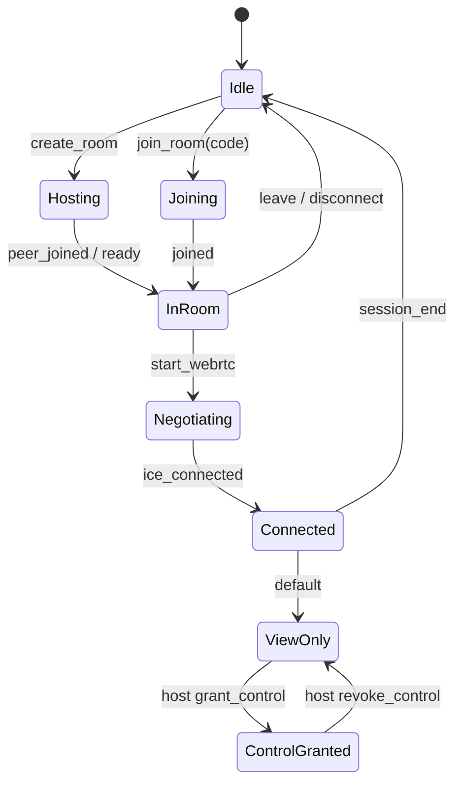

# Darpan — System Architecture

## Product summary

**Darpan** is a peer-to-peer remote desktop and file-transfer product. A Python server handles **signaling and session metadata only**. All screen video, remote input, and file bytes travel over **WebRTC** (media + SCTP/data channels) directly between peers.

| Client | Role |
|--------|------|
| **Desktop** (`Darpan.exe`, Qt 6.8.3, Windows first) | Full host and controller for PC↔PC |
| **Android** (`com.darpan.remote`) | Controller of PC; limited host (screen share to PC); no Android↔Android remote OS control |

**Defaults (v1):**

- Signaling: `ws://127.0.0.1:8765`
- Auth: room code + optional room PIN + device display name (no user accounts)
- NAT: public STUN + optional self-hosted **coturn** under `compose/` (credentials via env)

---

## Design principles

1. **Signaling-only server** — WebSocket JSON messages for presence, rooms, SDP/ICE relay, and control **permission** state. No video, audio, file chunks, or input events on the server.
2. **P2P after join** — Peers negotiate WebRTC in-room; server never terminates media.
3. **Host sovereignty** — Only the designated **host** may grant or revoke **remote control**. Others remain **view-only** until granted.
4. **Same room** — “Room” means a signaling session (room code). Only members in that room receive signals and permission updates.

---

## Repository layout

```
darpan/
├── CMakeLists.txt          # Desktop target Darpan
├── main.cpp
├── darpan.cpp / darpan.h   # Main window shell
├── cmake/                  # Qt version check, future helpers
├── include/                # Shared headers (version, constants)
├── assets/                 # Icons, fonts (future)
├── Ui/                     # Widgets, stylesheets
├── Signaling/              # (future) client ↔ Python WS
├── RemoteSession/          # (future) WebRTC session
├── Platform/               # (future) Windows capture / input
├── Utils/
├── docs/
├── server/                 # Python signaling package
├── android/                # Gradle app stub → full client
└── compose/                # Optional coturn (+ future signaling) compose files
```

Android Gradle structure (target):

```
android/
├── settings.gradle.kts
├── build.gradle.kts
├── gradle.properties
└── app/
    ├── build.gradle.kts
    └── src/main/...
```

---

## P2P stack (chosen)

| Layer | Desktop | Android |
|-------|---------|---------|
| Signaling | WebSocket client → Python server | OkHttp WebSocket |
| WebRTC | **libdatachannel** (C++17) | **Stream WebRTC** Android AAR |
| Screen to peer | Host **DPJ1** JPEG on `darpan.preview` data channel (v1) | Same |
| Control + files | WebRTC **DataChannel** (`docs/PROTOCOL.md`) | Control channel wired; files desktop-only v1 |

**STUN:** e.g. `stun:stun.l.google.com:19302` (configurable).

**TURN (optional):** coturn in `compose/docker-turn/`; static credentials via `.env` (clients read URL/user/password from Settings or `DARPAN_TURN_*` env on desktop). See `docs/CROSS_NETWORK.md`.

---

## Room lifecycle



1. **create_room** — Client A becomes **host**; server returns `room_id`, optional PIN requirement.
2. **join_room** — Client B supplies `room_id` + PIN if required; server assigns role `controller` (or `viewer` if multi-party later).
3. **signal** — Server relays `{type: offer|answer|ice, payload}` only to other member(s) in the same room.
4. **permission** — Host sends `grant_control` / `revoke_control`; server broadcasts `control_state` to room.

---

## Permission states

| State | Controller input | File transfer |
|-------|-------------------|---------------|
| `view_only` | Disabled | May be allowed by policy (default: host-initiated only in v1) |
| `control_granted` | Mouse/keyboard to host | Bidirectional P2P |

Host UI must show active controllers and a one-click **Revoke control**.

---

## Signaling protocol (JSON over WebSocket)

**Endpoint:** `ws://<host>:<port>/ws` (or `wss://` when TLS enabled)

Every message is a JSON object with **`"v": 1`** (integer protocol version) and **`"type"`** (string).

Size limits (server enforced):

| Content | Max size |
|---------|----------|
| Entire JSON frame | 64 KiB (default) |
| `sdp` in `signal` | 256 KiB |
| Forbidden types | `video`, `audio`, `file`, `file_chunk`, `input`, `input_event`, `clipboard`, `screen_frame` → `FORBIDDEN` |

Logging: server logs **message types and ids only**, not SDP bodies, at INFO.

---

### Client → server

#### `hello` (required first)

```json
{
  "v": 1,
  "type": "hello",
  "device_name": "My PC"
}
```

#### `ping`

```json
{ "v": 1, "type": "ping" }
```

#### `create_room`

```json
{
  "v": 1,
  "type": "create_room",
  "pin": "optional-plaintext-pin"
}
```

Omit `pin` for an open room. Server stores **bcrypt hash** only.

#### `join_room`

```json
{
  "v": 1,
  "type": "join_room",
  "room_id": "ABC123",
  "pin": "optional-if-room-protected",
  "role_hint": "controller"
}
```

`role_hint`: `"controller"` | `"viewer"` (optional). Default: first joiner after host becomes `controller` if none exists, else `viewer`.

#### `leave_room`

```json
{ "v": 1, "type": "leave_room" }
```

#### `signal` (WebRTC signaling relay only)

```json
{
  "v": 1,
  "type": "signal",
  "signal_type": "offer",
  "target_device_id": "optional-peer-device-id",
  "sdp": "v=0\r\n..."
}
```

```json
{
  "v": 1,
  "type": "signal",
  "signal_type": "answer",
  "target_device_id": "peer-device-id",
  "sdp": "v=0\r\n..."
}
```

```json
{
  "v": 1,
  "type": "signal",
  "signal_type": "ice",
  "target_device_id": "peer-device-id",
  "candidate": {
    "candidate": "candidate:...",
    "sdpMid": "0",
    "sdpMLineIndex": 0
  }
}
```

If `target_device_id` is omitted, server relays to **all other** members in the room.

#### `grant_control` / `revoke_control` (host only)

```json
{
  "v": 1,
  "type": "grant_control",
  "target_device_id": "controller-device-id"
}
```

```json
{
  "v": 1,
  "type": "revoke_control",
  "target_device_id": "controller-device-id"
}
```

#### `promote_host` (current host only)

```json
{
  "v": 1,
  "type": "promote_host",
  "target_device_id": "member-device-id"
}
```

#### `room_state` (request snapshot)

```json
{ "v": 1, "type": "room_state" }
```

---

### Server → client

#### `hello_ok`

```json
{
  "v": 1,
  "type": "hello_ok",
  "device_id": "64-char-hex"
}
```

#### `pong`

```json
{ "v": 1, "type": "pong" }
```

#### `room_created`

```json
{
  "v": 1,
  "type": "room_created",
  "room_id": "ABC123",
  "role": "host",
  "members": [
    {
      "device_id": "...",
      "display_name": "My PC",
      "role": "host"
    }
  ]
}
```

#### `room_joined`

```json
{
  "v": 1,
  "type": "room_joined",
  "room_id": "ABC123",
  "role": "controller",
  "members": [ "... same shape as below ..." ]
}
```

#### `room_left`

```json
{
  "v": 1,
  "type": "room_left",
  "room_id": "ABC123"
}
```

#### `room_state`

```json
{
  "v": 1,
  "type": "room_state",
  "room_id": "ABC123",
  "host_device_id": "...",
  "members": [
    {
      "device_id": "...",
      "display_name": "My PC",
      "role": "host"
    },
    {
      "device_id": "...",
      "display_name": "Laptop",
      "role": "controller",
      "control_state": "view_only"
    }
  ]
}
```

`control_state` appears only for non-host members: `"view_only"` | `"control_granted"`.

#### `member_joined`

```json
{
  "v": 1,
  "type": "member_joined",
  "room_id": "ABC123",
  "member": {
    "device_id": "...",
    "display_name": "Laptop",
    "role": "controller",
    "control_state": "view_only"
  }
}
```

#### `member_left`

```json
{
  "v": 1,
  "type": "member_left",
  "room_id": "ABC123",
  "device_id": "..."
}
```

#### `signal` (relayed)

```json
{
  "v": 1,
  "type": "signal",
  "room_id": "ABC123",
  "from_device_id": "...",
  "signal_type": "offer",
  "sdp": "v=0\r\n..."
}
```

#### `control_state`

```json
{
  "v": 1,
  "type": "control_state",
  "room_id": "ABC123",
  "device_id": "controller-device-id",
  "state": "control_granted"
}
```

#### `error`

```json
{
  "v": 1,
  "type": "error",
  "code": "ROOM_FULL",
  "message": "Human-readable detail"
}
```

**Error codes:** `NOT_REGISTERED`, `INVALID_MESSAGE`, `PAYLOAD_TOO_LARGE`, `RATE_LIMITED`, `ROOM_NOT_FOUND`, `ROOM_FULL`, `INVALID_PIN`, `NOT_IN_ROOM`, `FORBIDDEN`, `UNKNOWN_TARGET`, `ALREADY_IN_ROOM`

---

### Roles and host

| Role | Description |
|------|-------------|
| `host` | Room owner; only role that grants/revokes control and may `promote_host` |
| `controller` | May receive control permission |
| `viewer` | View-only participant |

- **create_room** assigns `host` to creator.
- If **host disconnects**, the remaining member with the smallest `device_id` (lexicographic) is promoted to `host`.
- **promote_host** transfers host explicitly (optional).

---

### Legacy table (quick reference)

| Client `type` | Server response / side effects |
|---------------|--------------------------------|
| `hello` | `hello_ok` |
| `create_room` | `room_created`, `room_state` |
| `join_room` | `room_joined`; others get `member_joined`, `room_state` |
| `leave_room` | `room_left`; others get `member_left`, `room_state` |
| `signal` | `signal` to peer(s) |
| `grant_control` / `revoke_control` | `control_state` to room |
| `ping` | `pong` |

Server **must reject** payloads above size limits. Never log SDP at INFO.

---

## Data channel protocol (P2P, binary)

Version byte `0x01`, message types (future `docs/PROTOCOL.md`):

- `0x10` input events (mouse, key)
- `0x20` file meta / chunk / complete / cancel

Not implemented in scaffold phase.

---

## Security (target)

- TLS (`wss://`) for production signaling
- DTLS-SRTP / SCTP encryption via WebRTC
- Room PIN: server stores **hash** (bcrypt or argon2), never plaintext
- No anonymous cross-room signaling; device_id bound to socket session

---

## Android scope

| Scenario | Support |
|----------|---------|
| Android controls Windows PC | Yes (view + approved control) |
| Windows views Android screen | Yes (MediaProjection host) |
| Android remote-controls another Android OS | **Out of scope** |
| PC↔PC | Full feature set |

---

## UI direction (desktop)

**Qt Widgets** with a **dark-first** custom QSS dashboard (not CrossDesk / Slint):

| Token | Value |
|-------|--------|
| `--bg-base` | `#0f1419` |
| `--bg-elevated` | `#1a2332` |
| `--accent` | `#2dd4bf` |
| `--text-primary` | `#e7ecf3` |
| `--text-muted` | `#8b99a8` |
| `--danger` | `#f87171` |
| Font | Segoe UI (Windows), 13px body, 18px page titles |
| Layout | Left nav (Host, Join, Settings) + content stack; 8px grid, 12px radius cards |

---

## Related documents

- `docs/IMPLEMENTATION_PLAN.md` — phased delivery
- `docs/BUILD.md` — build and run (scaffold)
